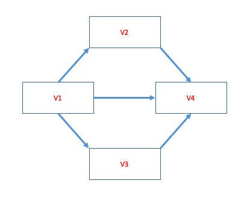
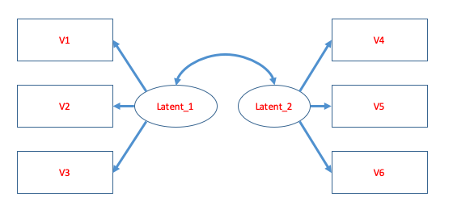

```{r setup, include=FALSE}
list.of.packages <- c("learnr","shiny","lavaan","semPlot","tidyverse")
new.packages <- list.of.packages[!(list.of.packages %in% installed.packages()[,"Package"])]
if(length(new.packages)) install.packages(new.packages)

library(lavaan)
library(semPlot)
library(tidyverse)
library(learnr)
knitr::opts_chunk$set(echo = FALSE)

checker <- function(label,user_code,solution_code,check_code,envir_result,evaluate_result,envir_prep,...){
  
  envir_result
  out <- list(message = sample(c("Good Job!",
                                 "Well done!",
                                 "Great stuff!",
                                 "That is correct!",
                                 "Correct! You are really good at this."),1), correct = TRUE, location = "append")

#Question 2
if(label == "question_2"){
	if(!exists("formula")){
		out <- list(message = "There is no object saved as `formula`. Make sure to save the SEM formula as this object.", correct = FALSE, location = "append")
	} else {
		if(!is.character(formula)){
			out <- list(message = "The object saved as `formula` does not appear to be a `lavaan` formula. Make sure you save the formula as this object.", correct = FALSE, location = "append")
		} else {
			test <- gsub("\\\n","",formula)
			test <- gsub(" ","",test)
			if (!grepl("musical_ability~a\\*rhythm",test)){
				out <- list(message = "The 'a' path does not appear to be specified correctly. Add the following code somewhere in the code above to do this: a*", correct = FALSE, location = "append")
			} else {
				if(!grepl("musical_ability~b\\*pitch",test)){
					out <- list(message = "The 'b' path does not appear to be specified correctly. Add the following code somewhere in the code above to do this: b*", correct = FALSE, location = "append")
				} else {
					if(!grepl("pitch~~rhythm",test)){
						out <- list(message = "There appears to be an error in the final line of the code. You may not need to edit this line to meet the objective...", correct = FALSE, location = "append")
					}
				}
			}
		}
	}
}

if(label == "question_3"){
	if(!exists("formula")){
		out <- list(message = "There is no object saved as `formula`. Make sure to save the SEM formula as this object.", correct = FALSE, location = "append")
	} else {
		if(!is.character(formula)){
			out <- list(message = "The object saved as `formula` does not appear to be a `lavaan` formula. Make sure you save the formula as this object.", correct = FALSE, location = "append")
		} else {
			test <- gsub("\\\n","",formula)
			test <- gsub(" ","",test)
			if (!(grepl("V4~V1\\+V2\\+V3",test) | grepl("V4~V1\\+V3\\+V2",test) | grepl("V4~V2\\+V1\\+V3",test) | grepl("V4~V2\\+V3\\+V1",test) | grepl("V4~V3\\+V1\\+V2",test) | grepl("V4~V3\\+V2\\+V1",test) | (grepl("V4~V1",test) & grepl("V4~V2",test) & grepl("V4~V3",test)))){
				out <- list(message = "There appears to be an error in the formula. In particular, all variables that predict V4 are not specified correctly.", correct = FALSE, location = "append")
			} else {
				if(!grepl("V3~V1",test)){
					out <- list(message = "There appears to be an error in the formula. In particular, all variables that predict V3 are not specified correctly.", correct = FALSE, location = "append")
				} else {
					if(!grepl("V2~V1",test)){
						out <- list(message = "There appears to be an error in the formula. In particular, all variables that predict V2 are not specified correctly.", correct = FALSE, location = "append")
					} else {
						if(grepl("V1~",test)){
						out <- list(message = "There appears to be an error in the formula. In particular, there should be no variables predicting 'V1'.", correct = FALSE, location = "append")
						}
					}
				}
			}
		}
	}
}

if(label == "question_5"){
	
	correct_Q5_data <- data.frame(sit1 = c(6,3,5,3,7,4,2,3,5,4,6,6,4,6,4,6,6,3,5,5,3,7,5,7,6,4,6,6,4,4,5,5,3,5,4,5,4,5,5,4,6,5,4,7,4,5,5,8,6,4,4,6,5,4,5,5,5,8,5,5,5,5,3,5,8,4,5,6,5,5,4,6,6,4,6,6,4,5,5,3,6,6,4,5,5,5,6,5,3,5),
	sit2 = c(4,6,6,3,4,6,5,4,5,5,6,6,6,8,5,6,6,5,4,6,6,5,4,6,5,6,7,4,3,6,4,3,7,4,6,5,5,6,3,4,4,5,3,6,4,3,5,5,6,6,4,6,6,6,5,6,5,4,4,4,6,5,5,5,3,4,5,6,4,6,5,5,7,4,8,6,5,5,5,3,6,6,6,4,7,5,6,6,3,6),
	sit3 = c(4,4,5,3,4,5,5,6,5,6,8,4,5,5,6,5,5,5,4,4,5,8,8,6,7,4,5,6,4,6,5,3,5,5,4,5,3,5,5,5,6,5,5,5,5,5,4,5,6,4,4,7,6,7,6,6,3,7,4,5,6,4,7,4,5,3,6,6,4,4,7,5,6,5,7,6,5,4,7,5,6,6,6,5,4,4,4,6,2,4),
	sit4 = c(6,4,6,3,5,5,4,4,6,6,5,6,5,6,4,5,5,5,4,4,3,7,5,6,5,7,3,5,5,4,6,5,5,7,5,4,5,5,5,5,5,4,4,6,6,6,5,5,7,4,4,5,5,3,7,5,3,5,5,4,5,4,5,4,4,5,5,5,6,7,4,5,5,5,6,5,4,4,6,5,5,5,6,5,4,6,4,5,4,5),
	sit5 = c(4,4,6,6,6,5,5,2,5,5,8,5,6,5,6,9,3,6,3,5,6,7,5,7,5,2,4,4,5,4,7,4,2,6,4,4,4,4,5,5,3,4,4,5,2,6,5,6,8,6,4,7,5,5,4,5,3,4,6,7,6,5,5,5,5,4,5,5,5,5,7,6,6,4,4,5,6,6,6,4,4,6,5,4,4,4,5,6,4,5))
	
	correct_ss_model <- sem(formula,data = Q5_data)
	
	if(!exists("formula")){
		out <- list(message = "There is no object saved as `formula`. Make sure to save the SEM formula as this object.", correct = FALSE, location = "append")
	} else {
		if(!is.character(formula)){
			out <- list(message = "The object saved as `formula` does not appear to be a `lavaan` formula. Make sure you save the formula as this object.", correct = FALSE, location = "append")
		} else {
			test <- gsub("\\\n","",formula)
			test <- gsub(" ","",test)
			if (!grepl("\\=~",test)){
				out <- list(message = "There are no latent variables specified in your model. Make sure you use the correct operator to specify the latent variable.", correct = FALSE, location = "append")
			} else {
				if(!exists("Q5_data")){
					out <- list(message = "The data.frame `Q5_data` appears to have been altered. Do not alter this data.frame. Click the 'Start Over' button if necessary.", correct = FALSE, location = "append")
				} else {
					if(!identical(Q5_data,correct_Q5_data)){
						out <- list(message = "The data.frame `Q5_data` appears to have been altered. Do not alter this data.frame. Click the 'Start Over' button if necessary.", correct = FALSE, location = "append")
					} else {
						s <- summary(ss_model)$PE %>%
							filter(op == "=~")
						if(!(nrow(s) == 5)){
						out <- list(message = "The final model does not match the correct answer. Please check there are no errors in the code.", correct = FALSE, location = "append")
						}
					}
				}
			}
		}
	}
} 

#Question 6
if(label == "question_6"){
	
	correct_Q6_data <- data.frame(V1 = c(-0.61,0.06,0.26,-0.15,2.12,0.15,1.31,2.63,-0.59,-0.88,-0.62,-0.68,-1.31,-0.81,0.51,-0.92,0.43,-0.68,0.56,-0.83,1.11,0.93,-4.57,-1.29,0.05,-0.17,2.59,-2.55,2.58,0.98,0.54,1.08,0.2,0.39,-2.92,2.64,1.27,-3.35,0.02,-3,-0.96,-0.9,0.89,0.5,1.21,-2.51,0.65,1.24,0.9,2.36,-2.21,1.53,0.88,-0.56,0.45,0.69,0.13,-0.95,-0.16,0.98,0.78,1.33,0.97,0.29,0.71,-0.69,-0.88,1.5,-1.33,-1.05,0.59,0.61,-0.89,1.65,0.13,0.48,1.21,-1.03,-1,-0.57,1.59,-0.87,-0.7,0.91,0.49,0.93,-0.81,-0.13,-0.4,-0.91),
	V2 = c(-1.07,-1.09,1.44,-0.76,0.4,-1.49,1,-1.32,1,-2.01,1.47,-0.48,1.13,0.88,1.36,1.09,-0.3,0.68,1.18,-1.29,0.83,0.59,-2.81,-2.04,-2.25,0.18,1.12,-2.48,0.33,0.34,1.68,0.53,-1.41,0.61,-1.76,0.94,0.11,-4.27,-1,-1.37,1.01,0.37,2.4,-0.29,-0.27,-2.28,-0.89,2.82,0.85,0.45,-3.35,-1.65,-0.35,1.11,1.6,-1.17,2.46,1.28,-0.46,2.4,3.42,-1.23,-0.28,-0.88,-1.62,-1.4,-0.11,0.89,0.59,0.13,-1.03,-0.18,-2.28,-1.66,-1.21,-2,0.62,-0.5,0.12,1.62,0.63,-0.38,-0.14,0.39,-0.72,0.69,1.86,0.35,-2.2,1.17),
	V3 = c(-1.66,-1.38,-0.33,0.18,1.41,-0.72,-1.11,0.86,1.17,-1.31,1.59,1.32,0.9,-2.34,1.58,1.62,0.95,0.41,1.82,-0.27,-0.43,1.88,-1.84,0.7,-0.87,1.01,0.88,0.21,-0.31,-0.65,0.01,0.28,-0.55,0.13,-0.96,-0.1,-1.26,-1.87,-0.29,-1.02,-2.89,-0.98,2.28,0.52,-1.31,-2.58,1.22,0.57,0.55,-0.85,-1.91,0.15,-0.79,-0.19,-0.93,-1.27,0.53,1.21,0.99,0.73,-0.37,-1.22,0.83,1.53,-0.09,-2.64,-1.58,0.52,-0.45,0.16,1.33,0.16,-0.14,1.81,0.51,0.14,0.47,-1.1,0.99,0.8,1.79,0.08,-0.2,0.3,-1.85,-1.46,-1.71,-0.31,-0.93,0.45),
	V4 = c(0.76,1.15,0.03,-0.62,1.93,-1.69,0.73,0.67,-0.58,1.14,-0.1,1.47,2.31,0.15,0.54,0.51,0.94,0.78,2.12,-1.12,-3.85,-0.51,0.59,-0.74,-0.97,0.7,-1.84,-1.08,-0.37,-2.37,3.23,0.78,-1.49,2.58,0.57,1.47,0.26,-4.13,-1.58,-1.22,1.06,-2.61,-2.84,-0.11,0.03,-0.67,-0.79,1.72,0.97,0.16,-1.14,-1.46,-1.73,-3.7,1.1,0.27,-0.64,0.38,2.01,2.33,2.11,-0.96,-0.31,1.37,-0.25,-2.3,-0.07,2.59,0.28,-2.12,0.98,-0.98,-2.41,-1.29,-0.35,0.01,-0.14,-1.48,0.3,4.64,-0.04,-1.35,-2.07,1.28,-1.59,0.9,-0.84,0.54,-0.55,0.33),
	V5 = c(1.41,-0.29,1.71,-0.57,3.83,-0.05,-0.27,1.65,1.65,0.82,-1.56,1.95,1.8,0.78,1.67,-0.09,0.76,2.17,1.76,-0.8,-3.18,1.4,-0.53,-1.44,-2.04,0,-3.18,-1.9,-2.02,-1.9,3.72,0.45,-0.61,0.72,-0.92,0.97,-1.8,-2.21,-2.58,-1.22,1.84,-1.84,-3.1,-0.16,1.92,-0.96,1.26,3.06,1.91,-0.28,-0.71,0.58,-1.28,1.62,-0.29,0.65,1.97,-0.3,-0.13,2.74,1.21,0.49,0.05,1.71,1.19,-3.17,-2.25,2.24,-0.81,-0.36,0.25,-1.73,-0.92,-0.41,-0.26,0.03,0,-0.5,0.61,2.16,-1.13,-2.31,0.13,1.07,-0.86,0.25,-0.24,1.3,0.64,-0.82),
	V6 = c(0.18,0.45,1.89,-0.81,1.69,-2.41,0.09,2.28,-1.69,0.48,-0.3,-0.36,1.51,-0.88,2.26,0.82,0.65,2.19,1.69,-3.03,-3.71,0.61,-1.37,-0.06,1.16,0.22,-2.53,-0.31,-1.29,-0.37,3.9,2.32,-1.16,0.01,0.05,-0.03,-1.17,-3.41,-2.87,-1.38,3.29,-1.38,-0.24,1.02,0.51,-3.16,-0.37,5.16,1.78,0.97,0.57,-0.66,-1.67,-0.67,-0.65,-0.39,0.31,0.52,-0.44,2.66,1.46,-0.88,2.17,2.13,0.82,-4.12,-0.84,3.26,2.75,-2.39,-2.26,-1.5,0.32,0.29,0.36,1.27,-0.75,-0.71,0.06,2.79,1.87,-2.29,-0.57,1.97,-1.55,1.69,0.39,2.76,1.2,-0.41))
	
	correct_model <- sem(formula,data = Q6_data)
	
	if(!exists("formula")){
		out <- list(message = "There is no object saved as `formula`. Make sure to save the SEM formula as this object.", correct = FALSE, location = "append")
	} else {
		if(!is.character(formula)){
			out <- list(message = "The object saved as `formula` does not appear to be a `lavaan` formula. Make sure you save the formula as this object.", correct = FALSE, location = "append")
		} else {
			test <- gsub("\\\n","",formula)
			test <- gsub(" ","",test)
			if (!grepl("\\=~",test)){
				out <- list(message = "There are no latent variables specified in your model. Make sure you use the correct operator to specify the latent variable.", correct = FALSE, location = "append")
			} else {
				if(!exists("Q6_data")){
					out <- list(message = "The data.frame `Q6_data` appears to have been altered. Do not alter this data.frame. Click the 'Start Over' button if necessary.", correct = FALSE, location = "append")
				} else {
					if(!identical(Q6_data,correct_Q6_data)){
						out <- list(message = "The data.frame `Q6_data` appears to have been altered. Do not alter this data.frame. Click the 'Start Over' button if necessary.", correct = FALSE, location = "append")
					} else {
						s <- summary(model)$PE 
						if(!(nrow(s %>% filter(op == "=~")) == 6)){
						out <- list(message = "The final model does not match the correct answer. Please check you have specified the latent variables correctly.", correct = FALSE, location = "append")
						} else {
							if(!(nrow(s %>% filter(op == "~~") == 9))){
								out <- list(message = "The final model does not match the correct answer. Please check there you have specified any covariances correctly.", correct = FALSE, location = "append")
							} else {
								out <- list(message = "While the submitted code has passed the checks, note that, given the complexities of an SEM model, checking all components can be difficult. To make sure you have the correct result, answer the question below correctly.", correct = TRUE, location = "append")
							}
						}
					}
				}
			}
		}
	}
}
          
  return(out)
}

tutorial_options(exercise.checker = checker)
```

## Introduction

This is the second-to-last of the weekly exercises. Almost there! These exercises are designed to reinforce content taught each week. Typically, they consist of quiz questions and R exercises that require you to enter code into a box. These exercises are usually split into beginner and advance sections; however, this week all exercises are advanced. It is expected that students can complete the beginner sections of each weekly exercise, with the advanced sections designed for students who want an extra challenge or learn additional functions in R. If you are struggling, each exercise comes with a number of hints that may be helpful.

## Basic Exercises

This week's exercises covers structural equation modelling and model comparisons, which are quite advanced statistical techniques. Therefore, all exercises this week could be considered "Advanced". Completing these exercises may help with your understanding of Stuctural Equation Modelling and content covered in the lecture, but you only need to complete them if you are keen to test your R skills.

## Advanced Exercises

### Question 1

Look at the formula below, then answer the following quiz question.

```{r question_1,exercise = TRUE,exercise.lines = 6}

formula <- '
  var1 ~ var2 + var3
  var2 ~ var4 + var5
  var3 ~ var6 + var7
'

```

```{r question_1-quiz}
quiz(
  question("The `lavaan` formula above includes which of the following relationships (select all appropriate answers):",
    answer("var1 is predicted from var2 and var3.",correct = TRUE),
    answer("var2 is predicted from var4 and var5.",correct = TRUE),
    answer("var3 is predicted from var6 and var7,",correct = TRUE),
    answer("var2 and var3 are covariates.",correct = TRUE),
    answer("var3 is a latent variable."),
    answer("var6 and var7 directly influences var1."),
    answer("The model includes a direct path between var4 and var1."),
    answer("var1 is a latent variable that explains var2 and var3."),allow_retry = TRUE,random_answer_order = TRUE
  )
)
```

### Question 2

Below is a `lavaan` formula. Edit the code so that the relationship between 'musical ability' and 'rhythm' is labelled as `a`, and the relationship between 'musical ability' and 'pitch' is `b`.

```{r question_2-setup}

```

```{r question_2, exercise=TRUE,exercise.lines = 12}
formula <- '
  musical_ability ~ rhythm
  musical_ability ~ pitch
  pitch ~~ rhythm
'
```

```{r question_2-hint-1}
The easiest way to define a path is using the `*` symbol.
```

```{r question_2-hint-2}
Another way to define a path is using the `:=` operator, but you won't need to use it for this question.

Next hint will show the solution...
```

```{r question_2-solution}
formula <- '
  musical_ability ~ a*rhythm
  musical_ability ~ b*pitch
  pitch ~~ rhythm
'
```

```{r question_2-check}
checker()
```

### Question 3

Below is a path diagram for a model. Create an object that holds the `lavaan` formula for this model.



```{r question_3-setup}

```

```{r question_3, exercise=TRUE,exercise.lines = 12}
formula <- '
  
'
```

```{r question_3-hint-1}
Make sure to use the exact variable names as the path diagram.
```

```{r question_3-hint-2}
You do not need to label any of the paths.

Next hint will show the solution...
```

```{r question_3-solution}
formula <- '
  V4 ~ V1 + V2 + V3
  V3 ~ V1
  V2 ~ V1
'
#OR
formula <- '
  V4 ~ V1
  V4 ~ V2
  V4 ~ V3
  V3 ~ V1
  V2 ~ V1
'
```

```{r question_3-check}
checker()
```

### Question 4

Edit the code below to run the SEM model from Question 3 using the data.frame saved as `Q4_data`. Answer the following question about the results.

```{r question_4-setup}
Q4_data <- data.frame(V1 = c(-0.79,-1.24,0.43,0.9,0.54,-0.09,-0.46,-0.91,-0.1,0.29,1.04,0.31,-0.99,-0.46,0.33,-0.59,-1.59,-0.1,-2.02,0.39,-1.46,-0.4,1.82,0.5,-0.34,0.91,-2.08,-0.77,-1.34,-1.41,-0.6,0.41,0.41,-0.61,0.48,-0.73,-1.43,2.93,0.5,-0.15,0.91,1.54,-0.77,-0.61,-0.06,0.61,0.87,0.05,-0.66,0.4,-2.58,0.19,-0.11,-0.56,-0.02,0.21,-1.05,0.29,1.04,0.01,0.66,-1.36,0.18,-0.42,-0.2,-0.11,0.83,-0.12,-0.41,0.8,-0.04,-0.1,-1.48,-0.03,-0.08,-0.3,0.83,1.39,-0.48,-1.13,-1.27,0.18,-2,0.97,-0.75,0,-0.3,-1.36,1.65,0.73,0.14,0.99,0.21,-0.15,-0.35,1.02,0.18,1.24,-0.25,0.49),
	V2 = c(-0.93,-0.31,0.89,2.2,1.6,-1.65,-0.87,-0.61,-0.38,0.4,1.06,-0.51,-0.78,-0.61,1.42,1.65,-2.44,1.05,-2.19,1.47,-0.94,-2.04,-1.3,2.39,-1.38,0.95,-0.94,-1.36,0.04,-0.56,0.79,-1.04,2.07,-1,1.28,-0.93,-1.78,3.1,-0.99,0.06,1.71,1.69,0.87,-1.18,-0.57,0.11,-0.36,-0.13,0.29,-0.48,-1.74,0.74,-1.05,1.35,-0.26,0.41,-0.72,1.63,1.04,-0.01,-1.21,-2.87,-1.61,-0.48,-0.13,-1.56,0.09,0.11,1.07,-0.59,1.1,0,-1.86,0.53,1.71,-0.47,0.06,2.94,-1.2,-1.29,-2.02,1.45,-1.79,1.19,0.46,-2.56,-0.59,0.36,1.21,2.3,-0.6,0.37,-0.91,-0.92,-0.82,1.1,0.16,0.07,1.9,0.45),
	V3 = c(1.73,1.56,-1.2,0.11,0.12,0.84,-1.95,-0.62,-0.8,-0.33,0.54,-2.41,-1.29,-1.39,-1.26,-1.24,-0.81,-2.54,1.41,0.82,-0.11,0.03,-1.11,-0.42,0.2,0.32,-0.99,-1.76,0.97,-0.99,0.94,0.56,-1.1,0.9,-0.86,0.51,-0.06,0.45,0.74,2.2,-1.56,0.93,-0.06,0.08,-0.79,-1.67,-0.11,-0.03,-0.72,1.2,-1.09,0.37,-0.35,-0.07,-0.68,-0.13,-1.26,-1.14,1.21,0.05,-0.13,-0.89,-1.17,1.31,-0.76,-1.08,1.06,0.43,0.47,-2.44,-0.77,0.56,-0.52,-0.52,0.11,0.08,0.76,0.9,0.46,-1.1,0.41,-0.03,-0.95,0.88,2.02,1.04,-0.7,0.38,-1.1,0.9,-1.64,-1.02,0.5,0.21,0.11,-1.9,-0.41,-2.11,-1.08,0.59),
	V4 = c(-1.56,-0.41,2.19,1.48,1.82,-1.34,-0.46,-0.69,0.53,1.76,-0.23,3.14,-0.93,-0.76,1.03,0.24,-1.53,2.45,-2.4,1.25,-0.78,-1.46,0.26,1.8,-1.03,1.56,1.53,0.84,-0.14,-1.92,-0.53,-1.21,1.61,-0.34,1.2,0.91,-0.68,2.6,-1.09,-2.11,1.5,-0.24,-1.49,-0.35,-0.98,1.08,0.17,1.64,1.61,-2.25,-1.3,-1.06,-0.36,0.31,-0.41,-0.35,1.19,3.81,1.45,-0.97,-0.12,-1.43,-1.92,-1.96,1.04,-0.59,0.35,1.47,-1.22,0.63,0.22,-1.08,-0.3,-0.26,0.89,-1.48,-2.64,3.04,-0.8,-0.81,-0.38,1.87,-0.03,0.31,-2.37,-3.25,0.59,1.09,3.62,-0.45,0.56,2.59,-0.62,-0.14,-2.55,0.5,-0.04,0.91,3.06,-0.1))
```

```{r question_4, exercise=TRUE,exercise.lines = 12}
#Q4_data
formula <- '
  V4 ~ V1
  V4 ~ V2
  V4 ~ V3
  V3 ~ V1
  V2 ~ V1
'

model <- sem()
summary(model)
```

```{r question_4-hint-1}
You may need to specify labels on paths to help answer the question.
```

```{r question_4-hint-2}
The path diagram shows two possible mediators. Therefore, to answer the question below, you may need to define the indirect effect of each mediator, as well as the direct effect of V1 on V4.

Next hint will show the solution...
```

```{r question_4-solution}
#A possible solution:
formula <- '
  V4 ~ c*V1
  V4 ~ b2*V2
  V4 ~ b3*V3
  V3 ~ a3*V1
  V2 ~ a2*V1

  indirect_V2 := a2*b2
  indirect_V3 := a3*b3
  direct := c
'

model <- sem(formula,data = Q4_data)
summary(model)
```

```{r question_4-quiz}
quiz(
  question("Based on the data above, select the correct statement:",
    answer("V1 has a significant direct effect on V4."),
    answer("V2 significantly mediates the relationship between V1 and V4.",correct = TRUE),
    answer("V3 significantly mediates the relationship between V1 and V4."),
    answer("There is no significant association between V1 and V4, and there are no significant mediations."),allow_retry = TRUE
  )
)
```

### Question 5

You're interested in measuring the social anxiety of children, so you observe the behaviour of 90 children across 5 social situation and give them a score on social anxiety for each ranging from 1 to 9. You wish to test whether a latent variable of 'social anxiety' underpins the scores across the 5 social situations. Run a Confirmatory Factor Analysis using `lavaan` functions. Save the formula as `formula` and the model as `ss_model`.

```{r, echo = FALSE}
Q5_data <- data.frame(sit1 = c(6,3,5,3,7,4,2,3,5,4,6,6,4,6,4,6,6,3,5,5,3,7,5,7,6,4,6,6,4,4,5,5,3,5,4,5,4,5,5,4,6,5,4,7,4,5,5,8,6,4,4,6,5,4,5,5,5,8,5,5,5,5,3,5,8,4,5,6,5,5,4,6,6,4,6,6,4,5,5,3,6,6,4,5,5,5,6,5,3,5),
	sit2 = c(4,6,6,3,4,6,5,4,5,5,6,6,6,8,5,6,6,5,4,6,6,5,4,6,5,6,7,4,3,6,4,3,7,4,6,5,5,6,3,4,4,5,3,6,4,3,5,5,6,6,4,6,6,6,5,6,5,4,4,4,6,5,5,5,3,4,5,6,4,6,5,5,7,4,8,6,5,5,5,3,6,6,6,4,7,5,6,6,3,6),
	sit3 = c(4,4,5,3,4,5,5,6,5,6,8,4,5,5,6,5,5,5,4,4,5,8,8,6,7,4,5,6,4,6,5,3,5,5,4,5,3,5,5,5,6,5,5,5,5,5,4,5,6,4,4,7,6,7,6,6,3,7,4,5,6,4,7,4,5,3,6,6,4,4,7,5,6,5,7,6,5,4,7,5,6,6,6,5,4,4,4,6,2,4),
	sit4 = c(6,4,6,3,5,5,4,4,6,6,5,6,5,6,4,5,5,5,4,4,3,7,5,6,5,7,3,5,5,4,6,5,5,7,5,4,5,5,5,5,5,4,4,6,6,6,5,5,7,4,4,5,5,3,7,5,3,5,5,4,5,4,5,4,4,5,5,5,6,7,4,5,5,5,6,5,4,4,6,5,5,5,6,5,4,6,4,5,4,5),
	sit5 = c(4,4,6,6,6,5,5,2,5,5,8,5,6,5,6,9,3,6,3,5,6,7,5,7,5,2,4,4,5,4,7,4,2,6,4,4,4,4,5,5,3,4,4,5,2,6,5,6,8,6,4,7,5,5,4,5,3,4,6,7,6,5,5,5,5,4,5,5,5,5,7,6,6,4,4,5,6,6,6,4,4,6,5,4,4,4,5,6,4,5))

Q5_data
```

```{r question_5-setup}
Q5_data <- data.frame(sit1 = c(6,3,5,3,7,4,2,3,5,4,6,6,4,6,4,6,6,3,5,5,3,7,5,7,6,4,6,6,4,4,5,5,3,5,4,5,4,5,5,4,6,5,4,7,4,5,5,8,6,4,4,6,5,4,5,5,5,8,5,5,5,5,3,5,8,4,5,6,5,5,4,6,6,4,6,6,4,5,5,3,6,6,4,5,5,5,6,5,3,5),
	sit2 = c(4,6,6,3,4,6,5,4,5,5,6,6,6,8,5,6,6,5,4,6,6,5,4,6,5,6,7,4,3,6,4,3,7,4,6,5,5,6,3,4,4,5,3,6,4,3,5,5,6,6,4,6,6,6,5,6,5,4,4,4,6,5,5,5,3,4,5,6,4,6,5,5,7,4,8,6,5,5,5,3,6,6,6,4,7,5,6,6,3,6),
	sit3 = c(4,4,5,3,4,5,5,6,5,6,8,4,5,5,6,5,5,5,4,4,5,8,8,6,7,4,5,6,4,6,5,3,5,5,4,5,3,5,5,5,6,5,5,5,5,5,4,5,6,4,4,7,6,7,6,6,3,7,4,5,6,4,7,4,5,3,6,6,4,4,7,5,6,5,7,6,5,4,7,5,6,6,6,5,4,4,4,6,2,4),
	sit4 = c(6,4,6,3,5,5,4,4,6,6,5,6,5,6,4,5,5,5,4,4,3,7,5,6,5,7,3,5,5,4,6,5,5,7,5,4,5,5,5,5,5,4,4,6,6,6,5,5,7,4,4,5,5,3,7,5,3,5,5,4,5,4,5,4,4,5,5,5,6,7,4,5,5,5,6,5,4,4,6,5,5,5,6,5,4,6,4,5,4,5),
	sit5 = c(4,4,6,6,6,5,5,2,5,5,8,5,6,5,6,9,3,6,3,5,6,7,5,7,5,2,4,4,5,4,7,4,2,6,4,4,4,4,5,5,3,4,4,5,2,6,5,6,8,6,4,7,5,5,4,5,3,4,6,7,6,5,5,5,5,4,5,5,5,5,7,6,6,4,4,5,6,6,6,4,4,6,5,4,4,4,5,6,4,5))
```

```{r question_5, exercise=TRUE,exercise.lines = 12}
#Q5_data
formula <- '

'

ss_model <- sem()
summary(ss_model)
```

```{r question_5-hint-1}
A confirmatory factor analysis is done by specifying latent variables. Latent variables are specified using the `=~` operator.
```

```{r question_5-hint-2}
You can use the `semPaths()` function to visualise the model. This can help you determine if you are specifying it correctly.

Next hint will show the solution...
```

```{r question_5-solution}
#A possible solution:
formula <- '
  social_anxiety =~ sit1 + sit2 + sit3 + sit4 + sit5
'
ss_model <- sem(formula,data = Q5_data)
summary(ss_model)
```

```{r question_5-check}
checker()
```

### Question 6

Below is a path diagram of two correlated latent variables from the data.frame `Q6_data`. Create and run the model using `lavaan` functions to determine the correlation between latent variables. Save the formula as the object `formula` and the model from the `sem()` function as `model`.



```{r,echo = FALSE}
Q6_data <- data.frame(V1 = c(-0.61,0.06,0.26,-0.15,2.12,0.15,1.31,2.63,-0.59,-0.88,-0.62,-0.68,-1.31,-0.81,0.51,-0.92,0.43,-0.68,0.56,-0.83,1.11,0.93,-4.57,-1.29,0.05,-0.17,2.59,-2.55,2.58,0.98,0.54,1.08,0.2,0.39,-2.92,2.64,1.27,-3.35,0.02,-3,-0.96,-0.9,0.89,0.5,1.21,-2.51,0.65,1.24,0.9,2.36,-2.21,1.53,0.88,-0.56,0.45,0.69,0.13,-0.95,-0.16,0.98,0.78,1.33,0.97,0.29,0.71,-0.69,-0.88,1.5,-1.33,-1.05,0.59,0.61,-0.89,1.65,0.13,0.48,1.21,-1.03,-1,-0.57,1.59,-0.87,-0.7,0.91,0.49,0.93,-0.81,-0.13,-0.4,-0.91),
	V2 = c(-1.07,-1.09,1.44,-0.76,0.4,-1.49,1,-1.32,1,-2.01,1.47,-0.48,1.13,0.88,1.36,1.09,-0.3,0.68,1.18,-1.29,0.83,0.59,-2.81,-2.04,-2.25,0.18,1.12,-2.48,0.33,0.34,1.68,0.53,-1.41,0.61,-1.76,0.94,0.11,-4.27,-1,-1.37,1.01,0.37,2.4,-0.29,-0.27,-2.28,-0.89,2.82,0.85,0.45,-3.35,-1.65,-0.35,1.11,1.6,-1.17,2.46,1.28,-0.46,2.4,3.42,-1.23,-0.28,-0.88,-1.62,-1.4,-0.11,0.89,0.59,0.13,-1.03,-0.18,-2.28,-1.66,-1.21,-2,0.62,-0.5,0.12,1.62,0.63,-0.38,-0.14,0.39,-0.72,0.69,1.86,0.35,-2.2,1.17),
	V3 = c(-1.66,-1.38,-0.33,0.18,1.41,-0.72,-1.11,0.86,1.17,-1.31,1.59,1.32,0.9,-2.34,1.58,1.62,0.95,0.41,1.82,-0.27,-0.43,1.88,-1.84,0.7,-0.87,1.01,0.88,0.21,-0.31,-0.65,0.01,0.28,-0.55,0.13,-0.96,-0.1,-1.26,-1.87,-0.29,-1.02,-2.89,-0.98,2.28,0.52,-1.31,-2.58,1.22,0.57,0.55,-0.85,-1.91,0.15,-0.79,-0.19,-0.93,-1.27,0.53,1.21,0.99,0.73,-0.37,-1.22,0.83,1.53,-0.09,-2.64,-1.58,0.52,-0.45,0.16,1.33,0.16,-0.14,1.81,0.51,0.14,0.47,-1.1,0.99,0.8,1.79,0.08,-0.2,0.3,-1.85,-1.46,-1.71,-0.31,-0.93,0.45),
	V4 = c(0.76,1.15,0.03,-0.62,1.93,-1.69,0.73,0.67,-0.58,1.14,-0.1,1.47,2.31,0.15,0.54,0.51,0.94,0.78,2.12,-1.12,-3.85,-0.51,0.59,-0.74,-0.97,0.7,-1.84,-1.08,-0.37,-2.37,3.23,0.78,-1.49,2.58,0.57,1.47,0.26,-4.13,-1.58,-1.22,1.06,-2.61,-2.84,-0.11,0.03,-0.67,-0.79,1.72,0.97,0.16,-1.14,-1.46,-1.73,-3.7,1.1,0.27,-0.64,0.38,2.01,2.33,2.11,-0.96,-0.31,1.37,-0.25,-2.3,-0.07,2.59,0.28,-2.12,0.98,-0.98,-2.41,-1.29,-0.35,0.01,-0.14,-1.48,0.3,4.64,-0.04,-1.35,-2.07,1.28,-1.59,0.9,-0.84,0.54,-0.55,0.33),
	V5 = c(1.41,-0.29,1.71,-0.57,3.83,-0.05,-0.27,1.65,1.65,0.82,-1.56,1.95,1.8,0.78,1.67,-0.09,0.76,2.17,1.76,-0.8,-3.18,1.4,-0.53,-1.44,-2.04,0,-3.18,-1.9,-2.02,-1.9,3.72,0.45,-0.61,0.72,-0.92,0.97,-1.8,-2.21,-2.58,-1.22,1.84,-1.84,-3.1,-0.16,1.92,-0.96,1.26,3.06,1.91,-0.28,-0.71,0.58,-1.28,1.62,-0.29,0.65,1.97,-0.3,-0.13,2.74,1.21,0.49,0.05,1.71,1.19,-3.17,-2.25,2.24,-0.81,-0.36,0.25,-1.73,-0.92,-0.41,-0.26,0.03,0,-0.5,0.61,2.16,-1.13,-2.31,0.13,1.07,-0.86,0.25,-0.24,1.3,0.64,-0.82),
	V6 = c(0.18,0.45,1.89,-0.81,1.69,-2.41,0.09,2.28,-1.69,0.48,-0.3,-0.36,1.51,-0.88,2.26,0.82,0.65,2.19,1.69,-3.03,-3.71,0.61,-1.37,-0.06,1.16,0.22,-2.53,-0.31,-1.29,-0.37,3.9,2.32,-1.16,0.01,0.05,-0.03,-1.17,-3.41,-2.87,-1.38,3.29,-1.38,-0.24,1.02,0.51,-3.16,-0.37,5.16,1.78,0.97,0.57,-0.66,-1.67,-0.67,-0.65,-0.39,0.31,0.52,-0.44,2.66,1.46,-0.88,2.17,2.13,0.82,-4.12,-0.84,3.26,2.75,-2.39,-2.26,-1.5,0.32,0.29,0.36,1.27,-0.75,-0.71,0.06,2.79,1.87,-2.29,-0.57,1.97,-1.55,1.69,0.39,2.76,1.2,-0.41))

Q6_data
```

```{r question_6-setup}
Q6_data <- data.frame(V1 = c(-0.61,0.06,0.26,-0.15,2.12,0.15,1.31,2.63,-0.59,-0.88,-0.62,-0.68,-1.31,-0.81,0.51,-0.92,0.43,-0.68,0.56,-0.83,1.11,0.93,-4.57,-1.29,0.05,-0.17,2.59,-2.55,2.58,0.98,0.54,1.08,0.2,0.39,-2.92,2.64,1.27,-3.35,0.02,-3,-0.96,-0.9,0.89,0.5,1.21,-2.51,0.65,1.24,0.9,2.36,-2.21,1.53,0.88,-0.56,0.45,0.69,0.13,-0.95,-0.16,0.98,0.78,1.33,0.97,0.29,0.71,-0.69,-0.88,1.5,-1.33,-1.05,0.59,0.61,-0.89,1.65,0.13,0.48,1.21,-1.03,-1,-0.57,1.59,-0.87,-0.7,0.91,0.49,0.93,-0.81,-0.13,-0.4,-0.91),
	V2 = c(-1.07,-1.09,1.44,-0.76,0.4,-1.49,1,-1.32,1,-2.01,1.47,-0.48,1.13,0.88,1.36,1.09,-0.3,0.68,1.18,-1.29,0.83,0.59,-2.81,-2.04,-2.25,0.18,1.12,-2.48,0.33,0.34,1.68,0.53,-1.41,0.61,-1.76,0.94,0.11,-4.27,-1,-1.37,1.01,0.37,2.4,-0.29,-0.27,-2.28,-0.89,2.82,0.85,0.45,-3.35,-1.65,-0.35,1.11,1.6,-1.17,2.46,1.28,-0.46,2.4,3.42,-1.23,-0.28,-0.88,-1.62,-1.4,-0.11,0.89,0.59,0.13,-1.03,-0.18,-2.28,-1.66,-1.21,-2,0.62,-0.5,0.12,1.62,0.63,-0.38,-0.14,0.39,-0.72,0.69,1.86,0.35,-2.2,1.17),
	V3 = c(-1.66,-1.38,-0.33,0.18,1.41,-0.72,-1.11,0.86,1.17,-1.31,1.59,1.32,0.9,-2.34,1.58,1.62,0.95,0.41,1.82,-0.27,-0.43,1.88,-1.84,0.7,-0.87,1.01,0.88,0.21,-0.31,-0.65,0.01,0.28,-0.55,0.13,-0.96,-0.1,-1.26,-1.87,-0.29,-1.02,-2.89,-0.98,2.28,0.52,-1.31,-2.58,1.22,0.57,0.55,-0.85,-1.91,0.15,-0.79,-0.19,-0.93,-1.27,0.53,1.21,0.99,0.73,-0.37,-1.22,0.83,1.53,-0.09,-2.64,-1.58,0.52,-0.45,0.16,1.33,0.16,-0.14,1.81,0.51,0.14,0.47,-1.1,0.99,0.8,1.79,0.08,-0.2,0.3,-1.85,-1.46,-1.71,-0.31,-0.93,0.45),
	V4 = c(0.76,1.15,0.03,-0.62,1.93,-1.69,0.73,0.67,-0.58,1.14,-0.1,1.47,2.31,0.15,0.54,0.51,0.94,0.78,2.12,-1.12,-3.85,-0.51,0.59,-0.74,-0.97,0.7,-1.84,-1.08,-0.37,-2.37,3.23,0.78,-1.49,2.58,0.57,1.47,0.26,-4.13,-1.58,-1.22,1.06,-2.61,-2.84,-0.11,0.03,-0.67,-0.79,1.72,0.97,0.16,-1.14,-1.46,-1.73,-3.7,1.1,0.27,-0.64,0.38,2.01,2.33,2.11,-0.96,-0.31,1.37,-0.25,-2.3,-0.07,2.59,0.28,-2.12,0.98,-0.98,-2.41,-1.29,-0.35,0.01,-0.14,-1.48,0.3,4.64,-0.04,-1.35,-2.07,1.28,-1.59,0.9,-0.84,0.54,-0.55,0.33),
	V5 = c(1.41,-0.29,1.71,-0.57,3.83,-0.05,-0.27,1.65,1.65,0.82,-1.56,1.95,1.8,0.78,1.67,-0.09,0.76,2.17,1.76,-0.8,-3.18,1.4,-0.53,-1.44,-2.04,0,-3.18,-1.9,-2.02,-1.9,3.72,0.45,-0.61,0.72,-0.92,0.97,-1.8,-2.21,-2.58,-1.22,1.84,-1.84,-3.1,-0.16,1.92,-0.96,1.26,3.06,1.91,-0.28,-0.71,0.58,-1.28,1.62,-0.29,0.65,1.97,-0.3,-0.13,2.74,1.21,0.49,0.05,1.71,1.19,-3.17,-2.25,2.24,-0.81,-0.36,0.25,-1.73,-0.92,-0.41,-0.26,0.03,0,-0.5,0.61,2.16,-1.13,-2.31,0.13,1.07,-0.86,0.25,-0.24,1.3,0.64,-0.82),
	V6 = c(0.18,0.45,1.89,-0.81,1.69,-2.41,0.09,2.28,-1.69,0.48,-0.3,-0.36,1.51,-0.88,2.26,0.82,0.65,2.19,1.69,-3.03,-3.71,0.61,-1.37,-0.06,1.16,0.22,-2.53,-0.31,-1.29,-0.37,3.9,2.32,-1.16,0.01,0.05,-0.03,-1.17,-3.41,-2.87,-1.38,3.29,-1.38,-0.24,1.02,0.51,-3.16,-0.37,5.16,1.78,0.97,0.57,-0.66,-1.67,-0.67,-0.65,-0.39,0.31,0.52,-0.44,2.66,1.46,-0.88,2.17,2.13,0.82,-4.12,-0.84,3.26,2.75,-2.39,-2.26,-1.5,0.32,0.29,0.36,1.27,-0.75,-0.71,0.06,2.79,1.87,-2.29,-0.57,1.97,-1.55,1.69,0.39,2.76,1.2,-0.41))
```

```{r question_6, exercise=TRUE,exercise.lines = 12}
#Q6_data
formula <- '

'

model <- sem()
summary(model)

semPaths()
```

```{r question_6-hint-1}
Latent variables are specified using the `=~` operator. Correlated variables are specified using the `~~` operator.
```

```{r question_6-hint-2}
To get the 'standardised solution', you will need to specify `standardized = TRUE` within the `summary()` function.

Next hint will show the solution...
```

```{r question_6-solution}
#A possible solution:
formula <- '
  latent1 =~ V1 + V2 + V3
  latent2 =~ V4 + V5 + V6
  latent1 ~~ latent2
'
model <- sem(formula,data = Q6_data)
summary(model,standardized = TRUE)
```

```{r question_6-check}
checker()
```

```{r question_6-quiz}
quiz(
  question("The covariance between the two latent variables in the 'standardised solution' is closest to:",
    answer(".00"),
    answer(".24"),
    answer(".53",message = "Incorrect. Check that you have the result for the 'standardised solution'."),
    answer(".59",correct = TRUE),allow_retry = TRUE
  )
)
```


